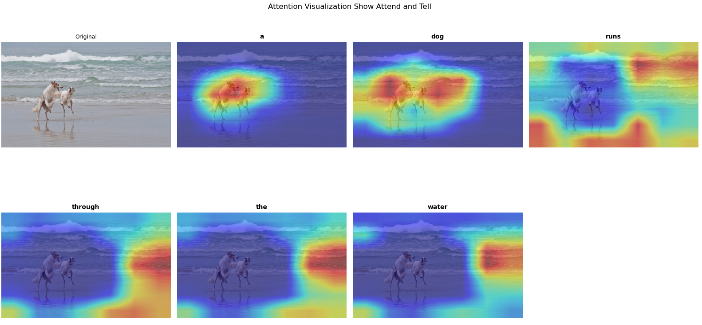

# Image Captioning on Flickr8k

Five image captioning architectures evaluated on a public benchmark, progressing
from a CNN-LSTM baseline to a Transformer decoder with cross-attention.

> No single model wins on all metrics. **Show, Attend and Tell leads on all BLEU metrics**
> (BLEU-4: 0.1915). **Dot-Product Attention leads on METEOR** (0.3961).
> The Transformer does not dominate despite being the most expressive architecture.

---

## Results

All models evaluated with greedy decoding and beam search (k=5).

| Model | Perplexity | BLEU-1 | BLEU-4 | METEOR |
|---|---|---|---|---|
| Show and Tell | **14.71** | 0.5952 | 0.1863 | 0.3877 |
| Show, Attend and Tell | 16.49 | **0.6206** | **0.1915** | 0.3767 |
| GloVe Init | 15.24 | 0.5761 | 0.1768 | 0.3897 |
| Dot-Product Attention | 15.21 | 0.6018 | 0.1902 | **0.3961** |
| Transformer | 15.27 | 0.5735 | 0.1800 | 0.3877 |

---

## Approach

| Model | Description |
|---|---|
| **Show and Tell** | ResNet-18 encoder + LSTM decoder, transfer learning |
| **Show, Attend and Tell** | Additive (Bahdanau) spatial attention over CNN feature maps |
| **Dot-Product Attention** | Scaled dot-product attention as alternative to additive |
| **GloVe Embeddings** | Pretrained word vectors vs. random initialisation |
| **Transformer Decoder** | Cross-attention to spatial image features |

---

## Key Findings

Attention consistently improves BLEU quality. Show, Attend and Tell leads on
all four BLEU metrics, with BLEU-4 rising from 0.1863 (baseline) to 0.1915.
Dot-Product Attention achieves the best METEOR (0.3961), showing that the
two attention variants capture different aspects of caption quality.

The Transformer decoder does not dominate at this scale. Despite being the
most expressive architecture, it scores lower than both attention-based LSTMs
on BLEU-4 (0.1800) and METEOR (0.3877). On 8,000 images, the inductive
biases of recurrent models compensate for the Transformer's greater capacity.

GloVe embeddings offer no consistent advantage. Pretrained word vectors
produced lower BLEU scores than random initialisation across all models,
suggesting the embedding layer adapts sufficiently during training on this
vocabulary size.

Perplexity and BLEU/METEOR rankings diverge. Show and Tell achieves the
lowest perplexity (14.71) but is outperformed on every generation quality
metric. This confirms that perplexity alone is an incomplete proxy for
captioning performance.

---

## Attention Visualisation

Spatial attention weights per generated word, using Show, Attend and Tell.
Red regions indicate where the decoder focused while predicting each token.

---

## Reproducibility

Dataset: [Flickr8k on Kaggle](https://www.kaggle.com/datasets/adityajn105/flickr8k)  

---

## Note on validation split

Flickr8k's official validation set was used as a training proxy for early
stopping and checkpointing. The reported test metrics therefore carry a slight
optimistic bias. A methodologically cleaner setup would hold the validation
set out entirely from checkpoint selection.
